# BDCrypto Portfolios Website


[Access the BDCrypto Portfolios Website here](https://bdcrypto-portfolio4.herokuapp.com/)(Ctrl + Click to open on a new tab)

## Table of Contents
1. [**UX**](#ux)
    - [**Purpose of the project**](#purpose-of-the-project)
    - [**User stories**](#user-stories)
    - [**Features**](#features)
    - [**Future features**](#future-features)

2. [**Typography and color scheme**](#typography-and-color-scheme)

3. [**Design**](#design)
    - [**Wireframes**](#wireframes)
    - [**ERD Diagrams**](#erd-diagrams)

4. [**Technologies Used**](#technologies-used)
    - [**Code validation**](#code-validation)
    - [**Test cases (user story based with screenshots)**](#test-cases)
    - [**Fixed bugs**](#fixed-bugs)
    - [**Supported screens and browsers**](#supported-screens-and-browsers)

5. [**Deployment**](#deployment)
    - [**Via Gitpod**](#via-gitpod)
    - [**Via Github Pages**](#via-github-pages)
6. [**Credits**](#credits)

---

## UX

## Purpose of the project

Welcome fellow visitor,

This is the BDCrypto portfolios website. It's an application that helps to manage portfolios with crypto assets and track their performance. The website has a simple yet effective interface and provides real use cases to cryptocurrency investors.

This website is made of the following sections:

1. Navigation bar with the title and menu.
2. Presentation with hero and login button.
3. Resgistration and login page.
4. List of portfolios that can be created by the user.
5. List of assets for every portfolio.
6. Possibility to create, edit and delete portfolios.
7. Possibility to add and remove assets to the portfolios.

The business goals for this application is to provide users an application easy to use and to track and manage their cryptocurrency holdings.

The target users are crypto enthusiasts of all ages looking for an application to manage their portfolios and track their performance.

## User stories

### EPIC | Website

- As a **Website User**, I can intuitively navigate around the site so that I can find the content I'm looking for.
- As a **Website User**, I can understand the purpose of the website so that I decide if it meets my needs.
- As a **Website User**, I can see all the valid coins available and their prices so that I decide where to invest.

### EPIC | User authentication

- As a **Website User** I can register an account so that I can create a portfolio to add/delete crypto assets.
- As a **Website User** I can Sign in and Sign out to my account so that I keep my account secure.

### EPIC | Portfolio CRUD

- As a **Website User**, I can create/edit and delete Portfolios of assets so that I can manage and track my crypto holdings.

### EPIC | Assets CRUD

- As a **Website User** I can create/buy, read/view, update/sell and delete assets on my Portfolio so that I can have it on my holdings.

## Features

- These are the features included on this release:

### Navbar

- The navbar contains an elusive title and a menu with links to the home and registration or login page.

### Call-to-action card

- The first card instigates the user to take action on the website and have a call-to-action button with a pulse effect to draw the user´s attention.

### Website information

- The following cards have usefull information about the website´s content. 

### Cryptocurrencies

- Below the cards, the website displays a list of the most known cryptocurrencies that the user can add to his portfolio.

### Regitration

- On the registration page, the user can register himself to create new portfolos and add assets to them.

### Login page

- On the login page the registered user can login and manage his portfolios and assets.

### Portfolios

- On the portfolios page, the user can create, read/view, update and delete portfolios linked to his account.

### Assets

- The user can use the assets list page to buy (create) new assets, read/view his assets, buy more quantity (update) existing assets, and sell partially (update) or totally (delete) his existing assets.

## Future features

- For the future deployments to the website, I would like to implement a full dashboard with graphics and analitics for the user to track the performance of his portfolio.

- I also would like to implement a back-end python job to store the data retrieved from the api before sending it to the user.

- Another implementation for the future will be the possibility to connect the portfolio to a crypto wallet.

## Typography and color scheme

- For the text, the main font used on the website was [Open Sans](https://fonts.google.com/specimen/Open+Sans) from [Google Fonts](https://fonts.google.com/). `Open Sans was designed with an upright stress, open forms and a neutral, yet friendly appearance. It was optimized for print, web, and mobile interfaces, and has excellent legibility characteristics in its letterforms.` [Font.](https://fonts.google.com/specimen/Open+Sans/about)

- For the website´s colors I used a purple pallette based on the [materialize colors](https://materializecss.com/color.html):

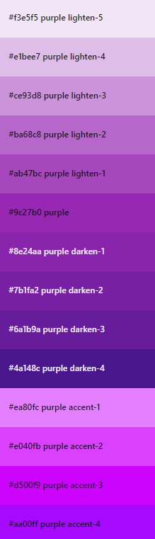

## Design

### Wireframes

This user interface for the website was first planned from scratch on Balsamic Wireframes with the license provided by the Code Institute. [Click here](./docs/readme/wireframes.pdf) to see the wireframes of the raw project.

Please note the actual website has changed slightly from these wireframes.

### ERD Diagrams

All the data needed to store on a functioning portfolio tracker was considered in order to create the database. Three relational databases were created: the first one is the default Django User database, which would store the usernames and passwords of all users which would allow them to login to the site, create portfolios and add tokens. The second one is the ´Portfolio´, created with a primary key of PortfolioID and a foreign key relationship to the Users database; it also contains the portfolio's name and creation date, as can be checked [here](https://github.com/Bruno-Diego/bdcrypto-portfolio4/blob/f6a572e44bbc878c21581867d2adbdc7c49130bc/home/models.py#L6). The third and last one is the Asset database, found [here](https://github.com/Bruno-Diego/bdcrypto-portfolio4/blob/f6a572e44bbc878c21581867d2adbdc7c49130bc/home/models.py#L23), which would be responsible for holding the data about a single asset within a single portfolio. The model contains a primary key of AssetID and a foreign key relationship with Portfolio which would allow the individual asset to be connect to a particular portfolio.

The relationship between the Portfolio and the Assets database is a zero-to-many as one portfolio could have zero or many assets within.

[Click here](./docs/readme/erddiagram.png) to see the ERD diagram of the raw project.

## Technologies Used

  - [HTML](https://developer.mozilla.org/en-US/docs/Web/HTML)
    - Used as the basic building block for the project and to structure the content.
  - [CSS](https://developer.mozilla.org/en-US/docs/Web/CSS)
    - Used to style all the web content across the project. 
  - [JAVASCRIPT](https://developer.mozilla.org/en-US/docs/Web/JavaScript)
    - Used mostly to add some interactivity to the web elements.
  - [Python](https://www.python.org/)
    - Used when creating the backend functionality in Django.
  - [GitHub](https://github.com/)
    - Used to store code for the project after being pushed.
  - GitHub [Project Boards](https://github.com/users/Bruno-Diego/projects)
    - Used to keep track of all the User Stories and Tasks necessary in order to build
  - [Gitpod](https://www.gitpod.io/)
    - Used as the development environment.
  - [Git](https://git-scm.com/)
    - Used for version control by utilising the Gitpod terminal to commit to Git and Push to GitHub.
  - [Materialize](https://materializecss.com/)
    - Used to as the front-end framework.
  - [Favicon.io](https://favicon.io/)
    - Used to create favicon for my website.
  - [Grammarly](https://www.grammarly.com/)
    - Used to fix the grammar errors across the project.
  - [Django](https://www.djangoproject.com/)
    - Used as Python-based free and open-source web framework that follows the model–template–views architectural pattern to develop the basic back-end of the project.
  - [SmartDraw](https://www.smartdraw.com/)
    - Used to make the ERD diagram for the project.
  - [Balsamiq Wireframes](https://balsamiq.com/)
    - Used to create the wireframes for the project.

## Code validation

  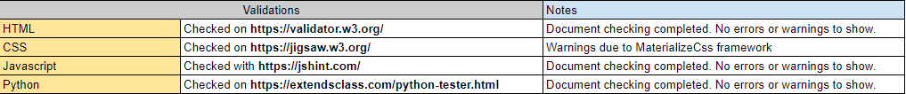

- HTML
  - No errors were returned when passing through the official [W3C validator](https://validator.w3.org/nu/?doc=https%3A%2F%2Fbdcrypto-portfolio4.herokuapp.com%2F).

- CSS
  - No errors were found on the website when passing through the official [(Jigsaw) validator](https://jigsaw.w3.org/css-validator/validator?uri=https%3A%2F%2Fbdcrypto-portfolio4.herokuapp.com%2F&profile=css3svg&usermedium=all&warning=1&vextwarning=&lang=en).

- JSHint
  - No errors were found on the website when using [JSHint Validator](https://jshint.com/install/).
    

- Python
  - No syntax errors detected on python code accordingly to [Python syntax checker](https://extendsclass.com/python-tester.html)
  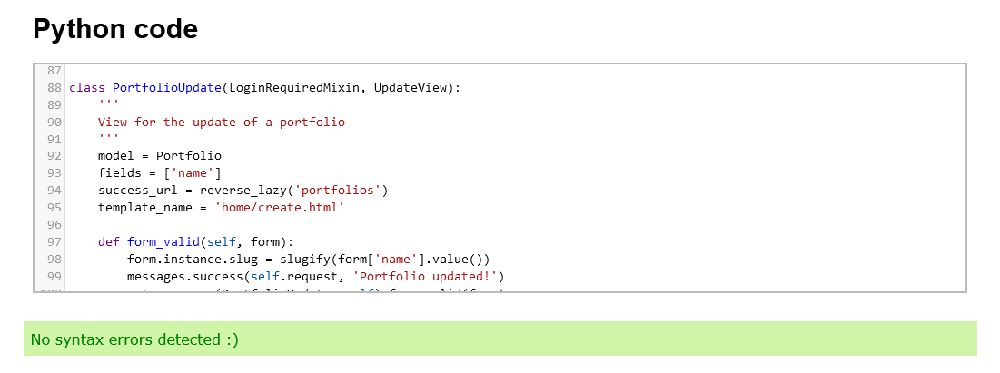


- [Lighthouse](https://developers.google.com/web/tools/lighthouse)
  - Lighthouse is a feature of Google Chrome developer tools and is used to assess the performance of the website and its features. I achieved a  good performance, assessibility, best practises and SEO scores, as you can see on this [report](./docs/readme/lighthousesummary.pdf).
    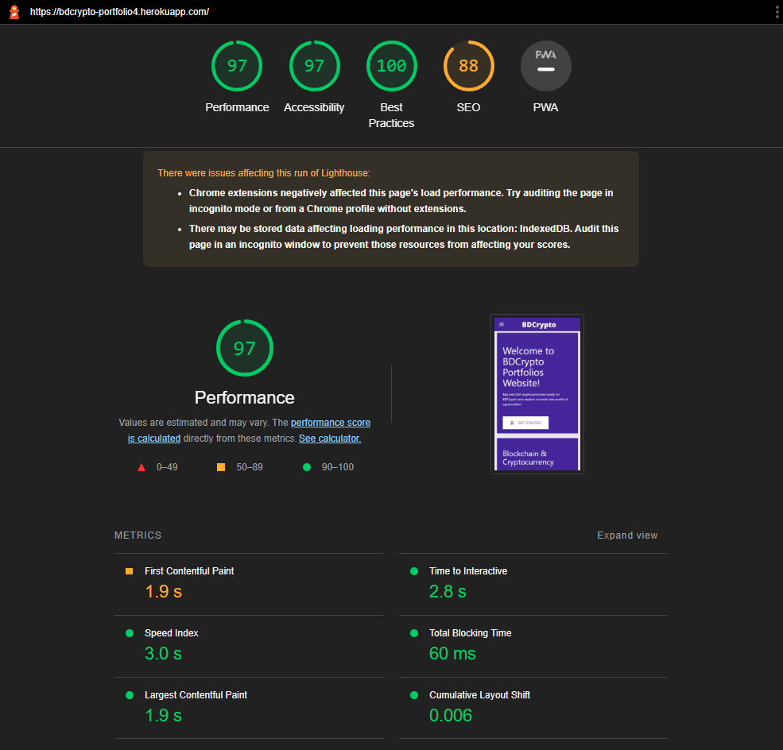

- [Color Contrast Accessibility Validator](https://color.a11y.com/)
  - Allowed me to test the colour contrast of my webpage.
    


## Test cases


1. As a **Website User**, I can intuitively navigate around the site so that I can find the content I'm looking for.
    - As soon as you enter the page you can easily see the navigation bar with title on the top left of the page, which is elusive to the website subject and is a link to refresh the home page.
    - On the left side of the navigation bar the user can see three links to home, to portfolios and to login page.
    - The user can click the Login link to be redirected to the login page and log in.
    - The user can click the Portfolios link to be redirected to his portfolios or the login page if he's not logged in.
    - The user can click the Home link or website's title "BDCrypto" to refresh or be redirected to the home page.

    

2. As a **Website User**, I can understand the purpose of the website so that I decide if it meets my needs.
    - The user can see at the home page a welcome card with a summary of the website's subject and a call-to-action button with a pulse effect.
    - The user click the call-to-action button and is redirected to the login page to log in or register himself.
    - Below the welcome block, the user can see blocks of information regarding terms related to the blockchain.

    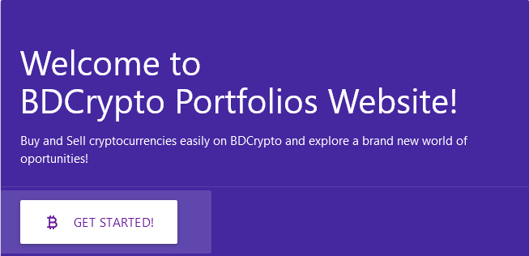
    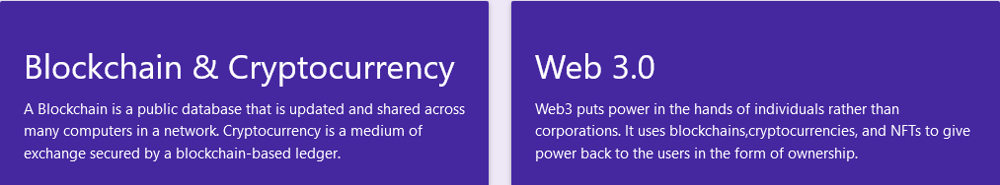

3. As a **Website User**, I can see all the valid coins available and their prices so that I decide where to invest.
    - The user can see on the main page a list with most available coins and their details.
    - At the end of the list, the user can see click the call-to-action button and is redirected to the login page to log in or register himself.

    

4. As a **Website User** I can register an account so that I can create a portfolio to add/delete crypto assets.
    - The user click in a call-to-action button in the home page and is redirected to the login page.
    - The user click on "Register here!" link at the bottom of the login page.
    - The website displays a registration form with Username, Password and Confirm Password fields.
    - The user fill the form and click Register.
    - The user is logged and can see a message in a baloon confirming the registration.
    - The user can see the portfolio list page.

    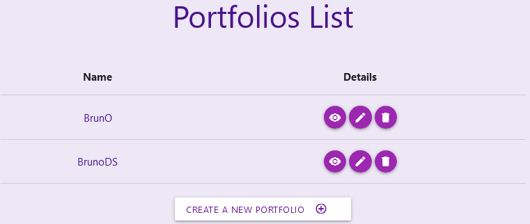

5. As a **Website User** I can Sign in and Sign out to my account so that I keep my account secure.
    - The user click in a call-to-action button in the home page or the link "Login" in the navigation bar.
    - The website displays a form with username and password field.
    - The user fill the form and click "Login" and is re-directed to the portfolios list.
    - The navigation bar displays a "Logout" link.
    - The user click "Logout" and is re-directed to the login page.

    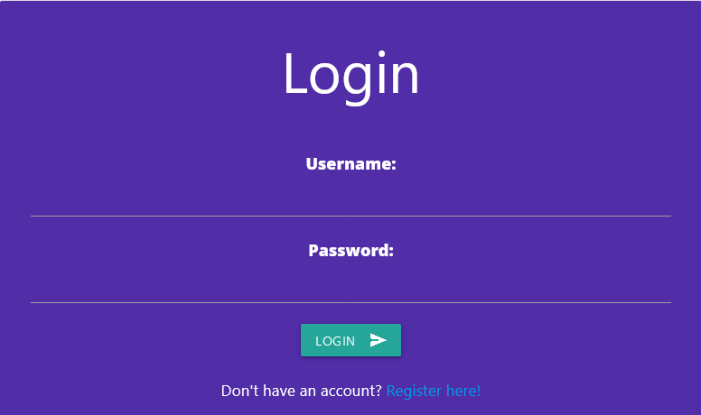

6. As a **Website User**, I can create/edit and delete Portfolios of assets so that I can manage and track my crypto holdings.
    - The user log in to the page and is directed to the portfolios list.
    - The user click on the button "Create a new portfolio" and is directed to a form in the Create Portfolio page.
    - The user type a name for his portfolio and click on Submit button.
    - The user is redirected to the portfolios list page and a message is displayed confirming the portfolio was created.
    - The portfolios list page displays all the portfolios with the buttons view, edit and delete.
    - To update the portfolio's name, the user clicks on the edit button and will be directed to a form to update the portfolio's name.
    - After choose a new name for his portfolio and click on Submit button. The user is redirected back to the portfolios list page and a message is displayed confirming the portfolio was updated.
    - To read the portfolio, the user clicks on the view button and will be directed to the assets page with the list of assets related to that portfolio.
    - To delete the portfolio, the user clicks on the delete button and will be directed to a confirmation page to confirm the user wants to delete that portfolio.

    

    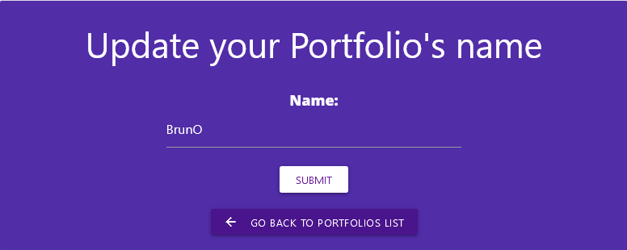

7. As a **Website User** I can create/buy, read/view, update/sell and delete assets on my Portfolio so that I can have it on my holdings.
    - The user log in to the page and is directed to the portfolios list.
    - The user click on view button on the portfolio he wants to create an asset and will be directed to the assets page with the list of assets related to that portfolio.
    - To add a new asset to the portfolio, the user click on "Buy Cryptocurrency" and is directed to a form in the create asset page.
    - The user select the cryptocurrency from a dropdown list and the quantity desired, then click submit. The user is redirected back to the assets list and view a message confirming the asset was added to the portfolio.
    - The assets list will display the crypto that was added with the fields Icon,	Symbol,	Quantity,	Price, Total, Value,	PnL and Actions with the buttons buy and sell.
    - The buy and sell buttons allow the user to update the asset.
    - To buy more of the same asset, the user clicks on "buy" button and will be directed to a form with the quantity field. The user insert the desired quantity that will be added to the total quantity of that asset.
    - The user click on the submit button and will be redirected back to the assets list and a confirmation message will be displayed.
    - To sell any quantity of the asset asset, the user clicks on "sell" button and will be directed to a form with the quantity field. The user insert the desired quantity that will be removed from the total quantity of that asset.
    - The user input a quantity greater than the full amount and click sybmit, an error message is displayed saying he can only sell the amount he holds.
    - The user click on the submit button and will be redirected back to the assets list and a confirmation message will be displayed.
    - To delete the asset, The user clicks on "sell" button and will be directed to a form with the quantity field. The user insert the total quantity that hhe holds on that asset. The user will be directed to the confirmation page to confirm he wants to sell the full amount and delete that asset.

    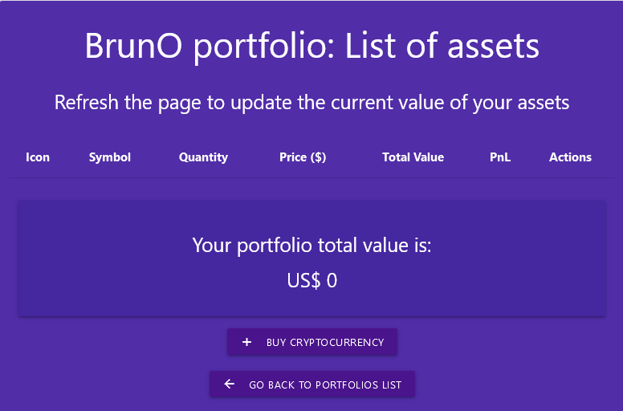

    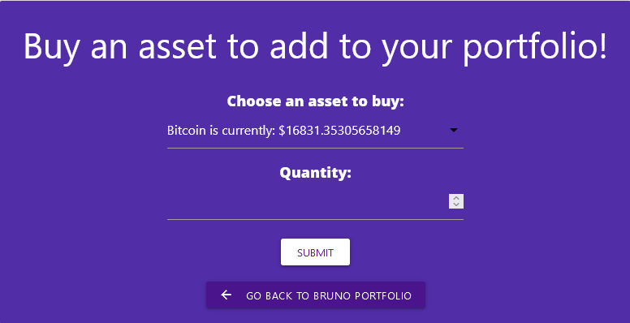

    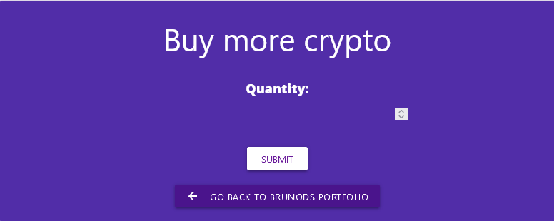

    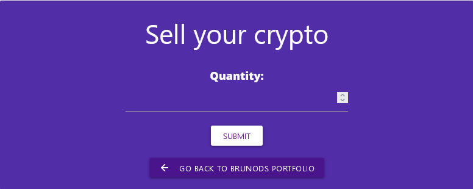

## Fixed bugs

**Home page view**
- In views.py, the home page view was coded as a function but it should be a class to be consistent with the rest of the code.
- To accomplish it, the generic view `TemplateView` had to be imported.
- It was:
```
def home_page(request):
    '''Function to display the home page'''
    return render(request, 'home/index.html')
```
and after fix:
```
class home_page(TemplateView):
    '''Function to display the home page'''
    template_name = 'home/index.html'
```
- Also, the class method `.as_view()` was added to the home_page url in urls.py.

## Supported screens and browsers

- The website is fully responsive and can be accessed on smartphones (width of 600px and smaller), tablets (width of 820px and smaller) and monitors of any size.

    * Small screens:
    
      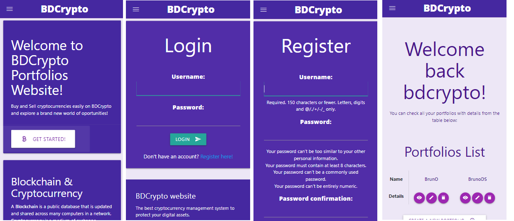

      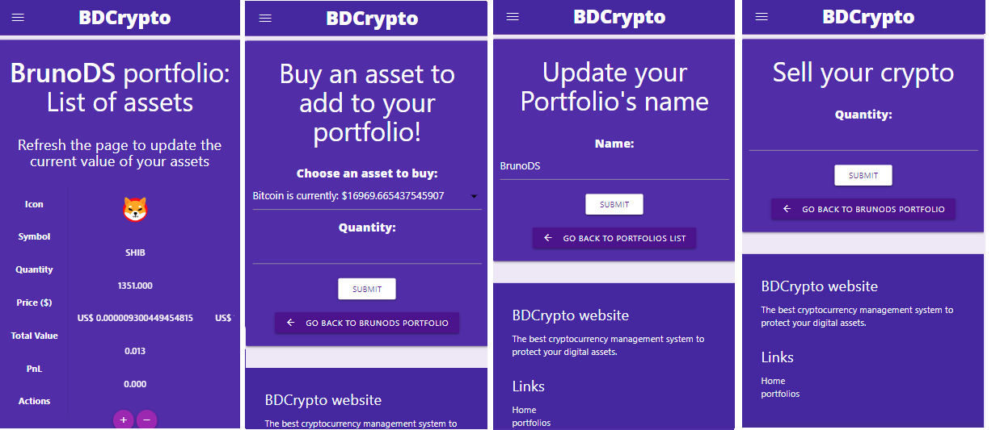

    ---
    * Medium screens:
    
      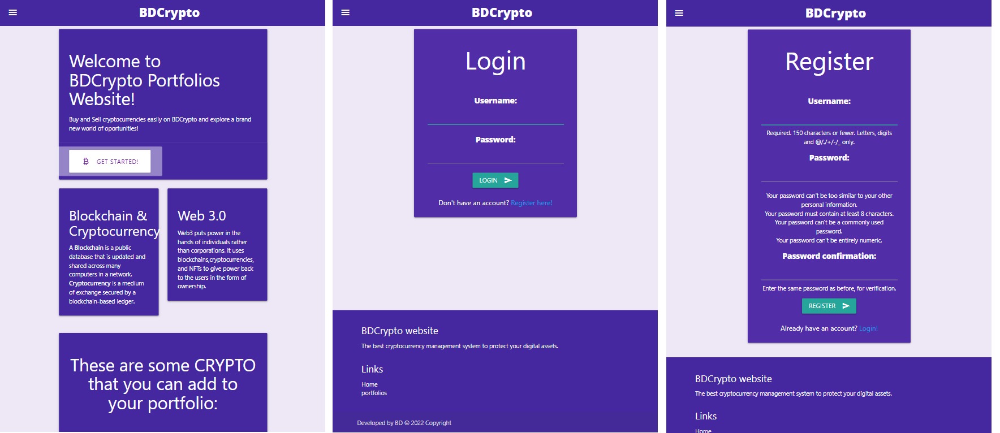

      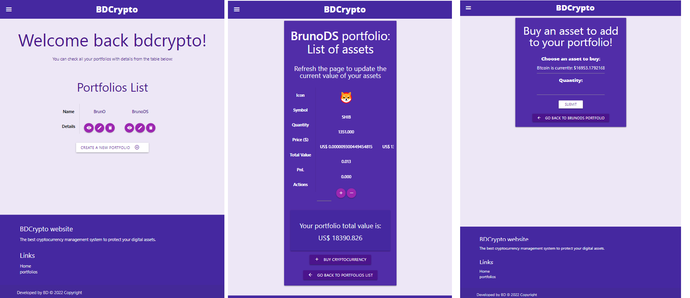
      
      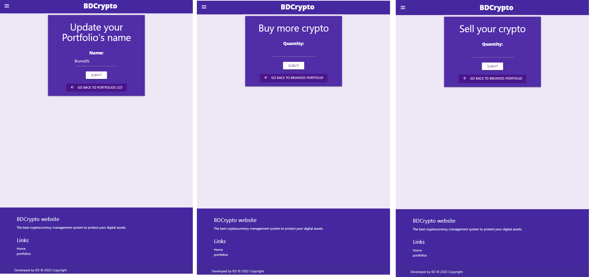

    ---
    * Large screens:
    
      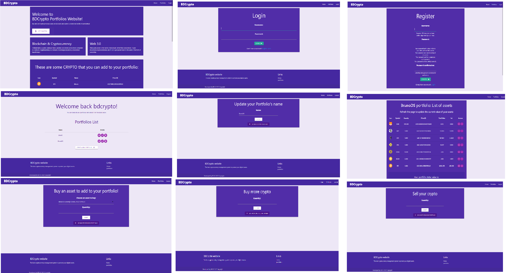


- The website was tested and is supported on the browsers Google Chrome, Mozilla Firefox, Microsoft Edge, Opera and Brave.

    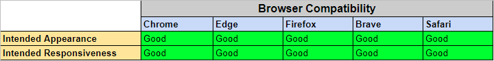

## Deployment

## Via Gitpod

The project deployment was based on the [Code Institute Gitpod Full Template](https://github.com/Code-Institute-Org/gitpod-full-template).

  - Click the `Use This Template` button.
  - Add a repository name and brief description.
  - Click the `Create Repository from Template` to create your repository.
  - To create a Gitpod workspace you then need to click `Gitpod`, this can take a few minutes.
  - When you want to work on the project it is best to open the workspace from Gitpod (rather than Github) as this will open your previous workspace rather than create a new one. You should pin the workspace so that it isn't deleted.
  -  Committing your work should be done often and should have clear/explanatory messages, use the following commands to make your commits:
    - `git add .`: adds all modified files to a staging area
    - `git commit -m "A message explaining your commit"`: commits all changes to a local repository.
    - `git push`: pushes all your committed changes to your Github repository.
  - You can view the website in a browser by using the command `python3 -m http.server` and clicking on the button `Open Browser` on the box that will pop up.

*Forking the GitHub Repository*

If you want to make changes to your repository without affecting it, you can make a copy of it by 'Forking' it. This ensures your original repository remains unchanged.

  1. Find the my [GitHub repository](https://github.com/Bruno-Diego/bdcrypto-portfolio4)
  2. In the top right corner of the page, click the Fork button (under your account)
  3. Your repository has now been 'Forked' and you have a copy to work on

*Cloning the GitHub Repository*

Cloning your repository will allow you to download a local version of the repository to be worked on. Cloning can also be a great way to backup your work.

  - Find the my [GitHub repository](https://github.com/Bruno-Diego/bdcrypto-portfolio4)
  - Press the arrow on the Code button
  - Copy the link that is shown in the drop-down
  - Now open Gitpod & select the directory location where you would like the clone created
  - In the terminal type 'git clone' & then paste the link you copied on GitHub
  - Press enter and your clone will be created.
  - You will need to also install all required packages in order to run this application on Heroku, refer to [requirements.txt](requirements.txt)
    - Command to install this apps requirements is `pip3 install -r requirements.txt`

## Via Heroku

Deploying the project using Heroku:

   - Login to [Heroku](https://dashboard.heroku.com/apps) and Create a New App
   - Give the App a name, it must be unique, and select a region closest to you
   - Click on 'Create App', this will take you to a page where you can deploy your project
   - Click on the 'Settings' tab at the top of the page. The following step must be completed before deployment. 
   - On ElephantSQL.com website, create an account by clicking on “Get a managed database today”, select “Try now for FREE” in the TINY TURTLE database plan, select “Log in with GitHub” and authorize ElephantSQL with your selected GitHub account, in the Create new team form: add a team name, read and agree to the Terms of Service, select Yes for GDPR, provide the email address and click “Create Team”.
   - Access your dashboard ElephantSQL, click “Create New Instance”, set up your plan: give your plan a Name, select the Tiny Turtle (Free) plan, you can leave the Tags field blank; Select “Select Region” and choose a data center near you, then click “Review”, check your details are correct and then click “Create instance”.
   - Return to the ElephantSQL dashboard and click on the database instance name for this project, then click "Details". 
   - Get your ElephantSQL database URL.
   - Back on Heroku, Scroll down to 'Config Vars' and click 'Reveal Config Vars'. Here the database URL is stored, it is the connection to the database, so this must be copied and stored within env.py as a root level file.
     - The env.py files is where the projects secret environment variables are stored. This file is then added to a gitnore file so it isn't stored publicly within the projects repository.
   - Next, the secret key needs to be created within the projects env.py file on GitPod and then added to the Config Vars on Heroku. Once added, go to the settings.py file on GitPod.
   - Within the [settings.py](settings.py) file you need to import several libraries:

    ```python
    import os
    import dj_database_url
    from django.contrib.messages import constants as messages
    if os.path.isfile('env.py'):
        import env
    ```

   - Then, we need to replace the current insecre secret key with ```os.environ.get('SECRET_KEY)'```, that we set witin the env.py file.
   - Once the secret key is replaced, scroll down to DATABASES to connect to the Postgres database. Comment out the current code and add the following python dictionary: 

```python
DATABASES = { 'default': dj_database_url.parse(os.environ.get('DATABASE_URL')) }
```

   - The next step is to connect the project to whitenoise, which is where the static files will be stored. You can find a full explanation of how to install whitenoise [here](http://whitenoise.evans.io/en/stable/)
   - Then on Heroku add to the Config Vars, DISABLE_COLLECTSTATIC = 1, as a temporary measure to enable deployment without any static files, this will be removed when it is time to deploy the full project.
   - Next we need to tell Django where to store the media and static files. Towards the bottom of settings.py file we can add:

```python
STATIC_URL = '/static/'
STATICFILES_DIRS = [os.path.join(BASE_DIR, 'static')]
STATIC_ROOT = os.path.join(BASE_DIR, 'staticfiles')
MEDIA_URL = '/media/'
```

   - Then we need to tell Django where the templates will be stored. At the top of settings.py, under BASE_DIR (the base directory), add a templates directory and then scroll down to TEMPLATES and add the templates directory variable to 'DIRS': [].
   - Now we have to add our Heroku Host Name into allowed hosts in settings.py file:

```python
ALLOWED_HOSTS = ['YOUR-APP-NAME-HERE', 'localhost']
```

   - Finally, to complete the first deployment set up of the app, create a Procfile so that Heroku knows how to run the project. Within this file add the following: web: gunicorn APP-NAME.wsgi Web tells Heroku to allow web traffic, whilst gunicorn is the server installed earlier, a web services gateway interface server (wsgi). This is a standard that allows Python services to integrate with web servers.
   - Now, go to the 'Deploy' Tab on Heroku. Find the 'Deployment Method' section and choose GitHub. Connect to your GitHub account and find the repo you want to deploy. 
   - Scroll down to the Automatic and Manual Deploys sections. Click 'Deploy Branch' in the Manual Deploy section and waited as Heroku installed all dependencies and deployed the code.
   - Once the project is finnished deploying, click 'Open App' to see the newly deployed project.
   - Before deploying the final draft of your project you must:
   - Remove staticcollect=1 from congifvars within Heroku
   - Ensure DEBUG is set to false in settings.py file or:
   - Set DEBUG to development with: development = os.environ.get('DEVELOPMENT', False) above it.

## Credits

- Throughout the process of building this website, I have used various sources online to help me fix bugs & tackle problems, in addition to various modules to build the functionality of this website:
  - The text for the info cards in the homepage taken from  [Ethereum website](https://ethereum.org/en/web3/) and [Wikipedia](https://en.wikipedia.org/wiki/Blockchain).
  - The icons and styles were taken from [Materialize](https://materializecss.com/).
  - The Django code was inspired by the Code Institute lessons and by the tutorial found on the [Denis Ivy](https://www.youtube.com/@DennisIvy) YouTube Channel. [Repository here.](https://github.com/divanov11/Django-To-Do-list-with-user-authentication)

---
## Acknowledgements

I would like to thank my course mentor Rohit Sharma for his support and guidance throughout the project and our Code Institute Cohort Facilitator Kasia Bogucka for their support & feedback.
---
